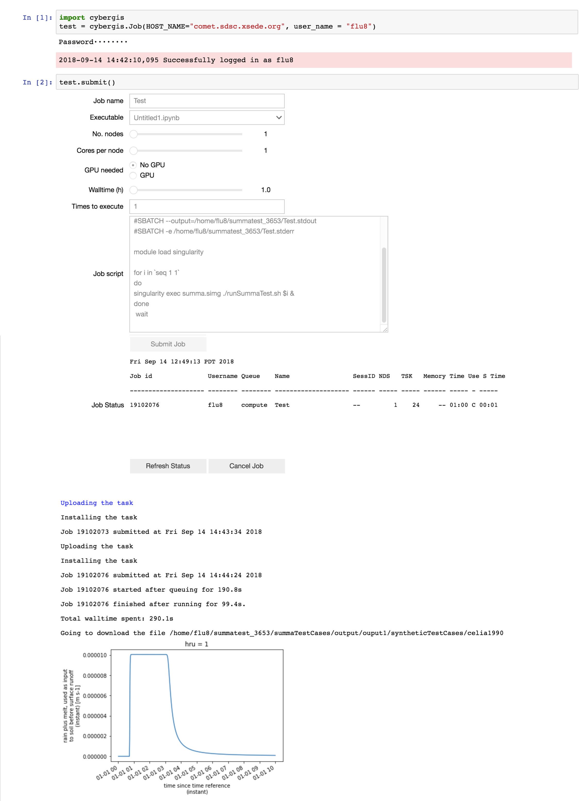
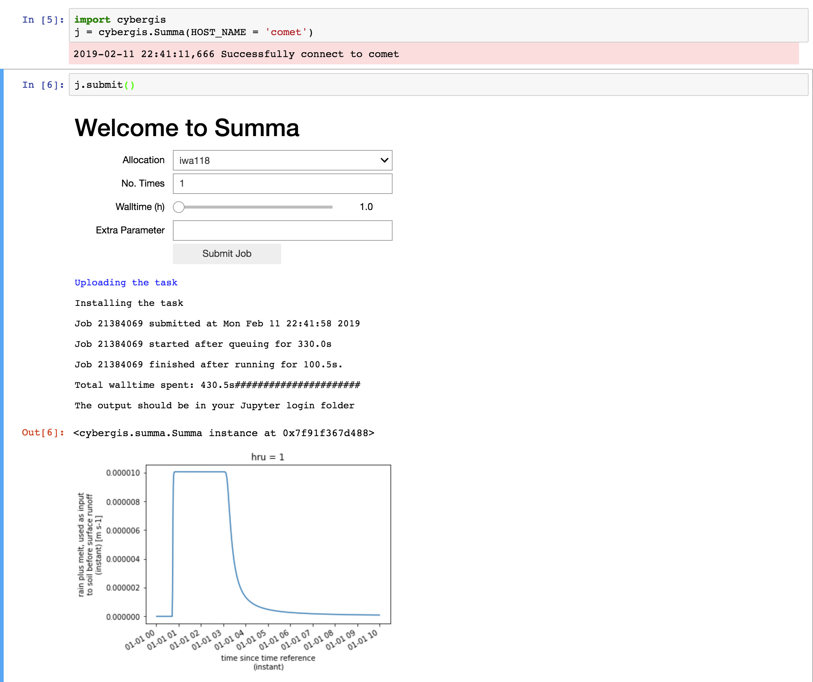
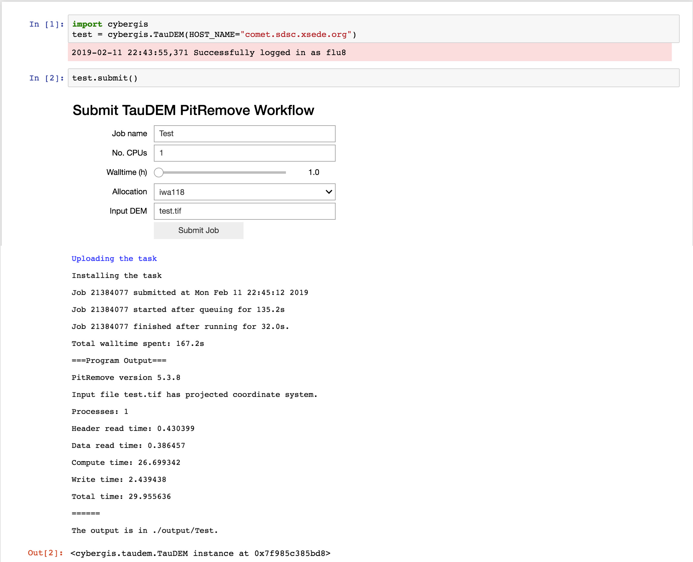

CyberGIS-Jupyter to submit to XSEDE Comet
=======================

This library is a production configuration for submitting HPC jobs from Jupyter notebooks. Here the [SUMMA](https://ncar.github.io/hydrology/models/SUMMA) model is used as the example Hydro model to be run on HPC; and the target HPC platform is [Comet](https://portal.xsede.org/sdsc-comet), which is one of the super-computeris that [XSEDE](https://www.xsede.org/) is managing.

The principle here is to use [Singularity](https://singularity.lbl.gov/) to pull the [SUMMA Docker image](https://hub.docker.com/r/bartnijssen/summa/tags/); and copy the SUMMA test data to Comet; and then construct and submit a HPC job script based on a existing template and user's inputs in the GUI widgest; Finally the status of the job is dynamically updated in the widgets, and the output graph is downloaded back and displayed in the notebook.

## Prepare

The folder `summatest/` contains the customized test data of SUMMA. The singularity image is not included in the repo due to its size. So to prepare the library, it is required to build the SUMMA singularity image from Dokcer hub using `singularity pull docker://bartnijssen/summa summa.img` in the `summatest/` folder.

Similarly, the folder `taudemtest/` contains the customized test data of TauDEM. It is required to build the Taudem singularity image from Dokcer hub using `singularity pull docker://wkmor1/docker-taudem taudem.simg` in the `taudemtest/` folder.

Besides, an account on Comet with corresponding allocation is needed to sign-in and complete the computation.

## Install

Run `python3 setup.py install` to install the `cyebrgis` python library.

## Usage

There is a [webpage](https://hsjupyter.cigi.illinois.edu:8000/hub/login) people can easily get access to the Jupyter notebook that has been built.

1. A basic example usage of this library is shown below (using the example notebook in the repo):

2. Summa test example

3. TauDEM test example

